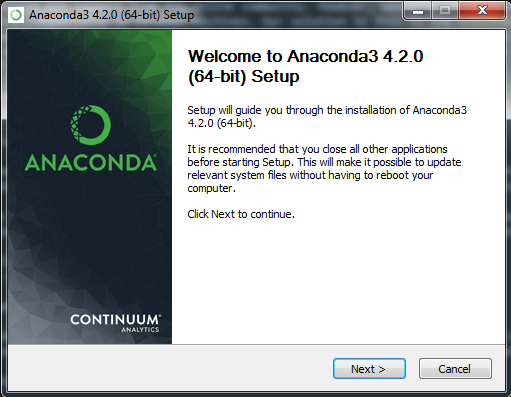
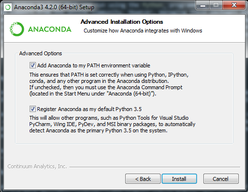
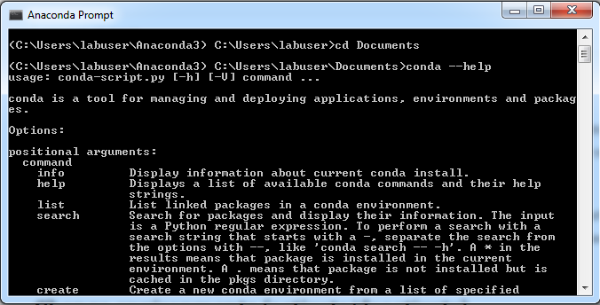
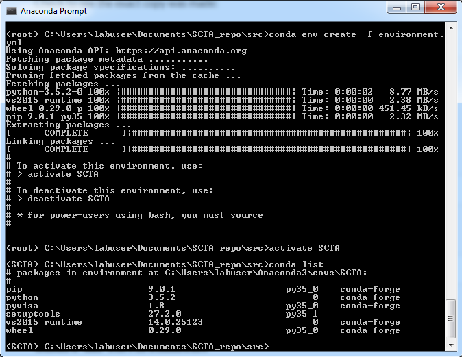
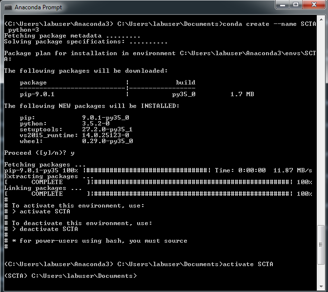
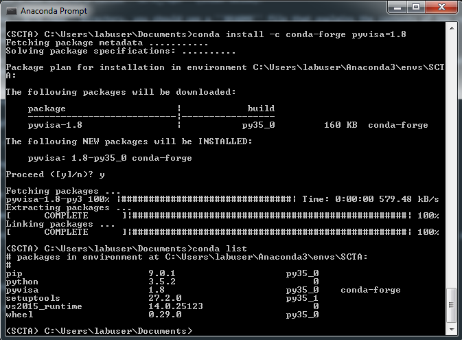

Anaconda v.s. Python
********************

No, this is not an epic battle between the two largest snakes in the world. 

The SCTA libraries form a Python package that you run using the Python_ programming language. Python is powerful for its wealth of open-source packages and support from the online community. However, managing these packages and their dependencies can be tedious and prone to error, especially on Windows machines. Our solution to this is the Anaconda_ package manager. Anaconda has servers dedicated to hosting Python packages, including PyVISA, which is a Python API to the :ref:`visa-installation-label`. Anaconda also provides command line tools for organizing our packages into ``environments`` that save the state of our packages for easy redeployment onto a new machine. All of this is explained in the following tutorial.

Installing Anaconda
-------------------

Go to the downloads_ page at the Anaconda website.

Choose ``Anaconda2-4.2.0-Windows-x86_64.exe`` (Python 3.5 version, 64-bit installer). If it prompts you with an advertisement to email you more materials, click "No Thanks". For Windows, it should download an executable. Run it, and click Yes when asking to allow changes to the computer.

In the Anaconda Setup service, agree to the license agreement and use the default installation destination. In the "Advanced Installation Options", use the default options if you don't already have Python installed on your machine. If you already have Python installed, you can check or uncheck the options based on your preference. The installation should be quick.

Anaconda Basics
---------------

In programs, open Anaconda Prompt.

Use Anaconda Prompt like any other Command Prompt or Terminal application. It defaults to the user home directory, but you can change directories using ``cd`` and list directory contents using ``dir``. For example, change to your Documents directory::

   cd Documents

Beyond the default shell commands, Anaconda Prompt also has ``conda`` commands built-in. To see a list of all available commands run::

   conda --help

Note that the prompt is "decorated" with ``<C:\Users\labuser\Anaconda3>``. This refers to the default Anaconda ``environment`` any of your Python code will be running in. To see which packages are in this environment::

   conda list

Later in the tutorial, we will be creating a much more slimmed down ``environment`` specifically for running our SCTA code.

Update the conda package manager for good measure::

   conda update conda

.. hint:: For more advanced commands and environment management, try this tutorial_.

.. _anaconda-clone-environment-label:

The Easy Way: Cloning our SCTA Environment
------------------------------------------

.. note:: To run the following commands, you must first complete the :ref:`git-installation-label` Installation. After cloning the Git repository, you should have the ``SCTA_repo`` directory.

To clone our SCTA Environment::

   cd SCTA_repo\install\Anaconda3\envs
   conda env create -f SCTA-environment.yml

Once the environment is created, ``activate`` it and check that ``pyvisa`` v. 1.8 was linked to the environment::

   activate SCTA
   conda list

The output should look something like this.

.. note:: To run any SCTA code, you **MUST REMEMBER** to ``activate SCTA``. This is how you "link" the ``pyvisa`` package that we use extensively in the SCTA libraries.

The Hard Way: Creating your own SCTA Environment
------------------------------------------------

If you wish to create your own SCTA environment, first create an environment with Python 3::

   conda create --name SCTA python=3

This will include Python 3's package manager and other base Python 3 packages. When prompted to proceed, enter "y". After it is complete, ``activate`` the environment::

   activate SCTA

You should see that the prompt is now "decorated" with ``<SCTA>``.

Now, we will install all other necessary packages to run our SCTA code. Install them using::

   conda install -c conda-forge pyvisa=1.8

When prompted to proceed, enter "y". Check that ``pyvisa`` v. 1.8 was linked to your environment::

   conda list

Repeat the procedure for ``paramiko`` and ``scipy`` packages.

.. note:: You can follow a similar process to install ``pyvisa``, ``paramiko``, and ``scipy`` into a Python virtualenv using ``pip install`` commands.

Adding SCTA to your PYTHONPATH Environment Variable
---------------------------------------------------

If you want ``import SCTA`` to work in your Python scripts out-of-the-box, you will need to modify your PYTHONPATH environment variable. This is because Python searches the PYTHONPATH for any libraries you import.

One way to do this is to configure Anaconda to modify PYTHONPATH for you every time you ``activate SCTA``. To do this, you need to add special batch files to your Anaconda installation directories. The batch files ``env_vars`` can be found under ``SCTA_repo\install\Anaconda3\etc\conda\activate.d\`` and ``SCTA_repo\install\Anaconda3\etc\conda\deactivate.d\``.

Follow this guide_ to place these batch files in the appropriate Anaconda installation directories, and modify the ``SCTA_repo\install\Anaconda3\etc\conda\activate.d\env_vars`` batch file to add the correct path to ``SCTA_repo\src`` on your own machine.

.. hint:: For me, the location of my Anaconda environment was ``C:\Users\labuser\Anaconda3\envs\SCTA``. It may not be the same for you.

.. _Python: https://en.wikipedia.org/wiki/Python_(programming_language)

.. _Anaconda: https://en.wikipedia.org/wiki/Anaconda_(Python_distribution)

.. _downloads: https://repo.continuum.io/archive/index.html

.. _tutorial: http://conda.pydata.org/docs/using/envs.html

.. _guide: https://conda.io/docs/using/envs.html#windows