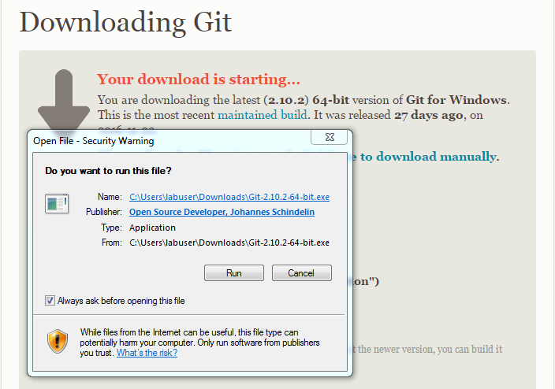
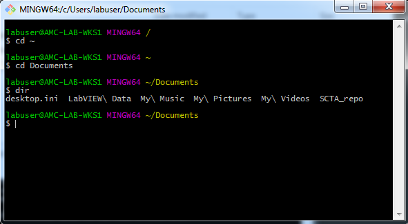
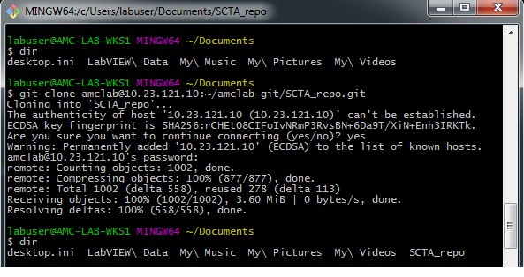
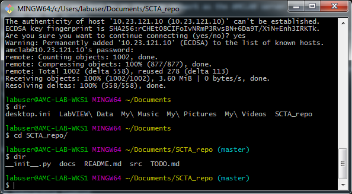
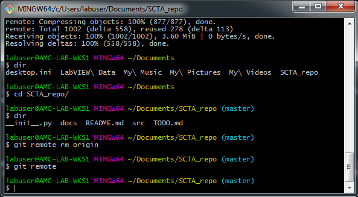

.. _git-installation-label:

Git Version Control
*******************

The SCTA libraries are stored on the AMCLAB server in the form of a Git repository. Git_ is a Version Control System that developers use to store historical snapshots of code throughout its lifetime. We use Git to store the most updated version of the SCTA libraries as well as previous working versions. In this tutorial, you will be downloading the most recent version of SCTA through Git.

.. note:: The following installation instructions are for Windows PCs only! Installing Git on Ubuntu should be as simple as an ``apt-get install git`` command.

Installing Git
--------------

Go to the downloads_ page at the Git website.

Choose the appropriate installer for your OS. For Windows, it should download an executable. Run it, and click Yes when asking to allow changes to the computer.

In the Git Setup service, use the default installation destination, components, start menu shortcuts, PATH environment, line ending conversions, terminal emulator, and extra options. The installation should be quick.

Cloning the SCTA Libraries
--------------------------

In programs, open Git Bash.

Use Git Bash like any other Command Prompt or Terminal application. It defaults to the computer's root directory, but you can change directories using ``cd`` and list directory contents using ``dir``. For example, change to your Documents directory::

   cd ~\Documents\

Beyond the default shell commands, Git Bash also has Git commands built-in. To see a list of all available commands run::

   git --help

.. note:: To run the following commands, you must be on the same network as the AMCLAB server. You must also know the AMCLAB server password. Ask someone from the lab for access.

To "download" the SCTA libraries, we will use Git to ``clone`` the SCTA repository from the AMCLAB server to our local machine::

   git clone amclab@10.23.121.10:~/amclab-git/SCTA_repo.git

If prompted to trust the authenticity of amclab, enter "yes". When prompted for a password, enter the password. After doing the ``clone``, you should see a new directory called ``SCTA_repo``.

If you change into the ``SCTA_repo`` directory, you should see a ``README`` file that explains the contents of the repository. You should also see the prompt is "decorated" with ``(master)``. This refers to the current Git ``branch`` any of your ``commit`` s will be saved to. However, this is beyond the scope of this tutorial. 

.. hint:: However, we **highly** recommend you come back to this later and use Git Version Control utilities when working on any serious programming project. There are several Git tutorials_ that show you how to view historical changes.

To be safe, remove the AMCLAB server's original repository address so that you won't ever accidentally write changes to the master copy of our SCTA libraries::

   git remote rm origin

If you run the ``git remote`` command, nothing should be printed to the prompt.

.. _Git: https://en.wikipedia.org/wiki/Git

.. _downloads: https://git-scm.com/downloads

.. _tutorials: https://git-scm.com/book/en/v2/Git-Basics-Viewing-the-Commit-History