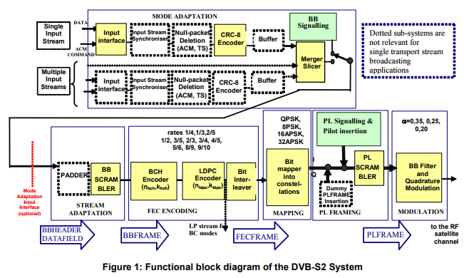

Specification Libraries
***********************

.. warning:: **This must be updated regularly! Always read through these libraries before writing any test script. Make sure they contain the most updated specifications relevant to your test.**

The Specification Libraries contain all the up-to-date specifications and pass/fail criteria. This includes the `MODCOD Specification Table`_ , `Scrambling Code Table`_ , and `ODU Specification Table`_ . All test procedures use these libraries to determine the correct test conditions and evaluation, so it is **imperative** that all updates to the DVB-S2 Specification are reflected here.

   DVB-S2 modulation and coding system block diagram. Physical Layer Scrambling is performed before modulation for efficient energy dispersal.

More importantly, the Specification Libraries provide one simple interface to reconfigure all existing automation scripts for your own test spec. Adapting these libraries is as simple as modifying or adding a CSV file. Feel free to modify or add specifications that are relevant to your own tests. 

.. _modcod-spec-class-label:

MODCOD Specification Table
--------------------------
The MODCOD Specification Table stores the C/N Threshold for Quasi-Error Free (QEF) performance for each MODCOD specified in the DVB-S2 Specification (`EN 302 307-1`_). It is implemented as a ``dictionary`` of MODCOD Spec Entries addressed by mode number. These values are extracted from the ``raw/DVBS2_Spec.csv`` file, and thus the values can be easily modified by making changes to this file.

All values are sourced from EN 302 307-1 V1.4.1 Table 12 (p.32) and Table 13 (p.36). Also see the DVB-S2 Implementation Guidelines (`ETSI TR 102 376`_) for typical transponder settings.

.. note:: This table is used in the :ref:`mode-class-label` to initialize MODCOD Mode instances.

Attributes
~~~~~~~~~~
- Mode number
- Broadcast Standard
- Modulation
- Code Rate
- QEF Point
- SNR threshold

Code Example
~~~~~~~~~~~~
This is how to access information about MODCOD Mode 1.

>>> MODCOD_Spec.getBroadcastStandard(1)
'DVB-S2'
>>> MODCOD_Spec.getConstellation(1)
'QPSK'
>>> MODCOD_Spec.getCodeRate(1)
'1/4'
>>> MODCOD_Spec.getCNRThresh(1)
-2.35
>>> MODCOD_Spec.getQEFpoint(1)
1e-7

.. _scrambling-code-table-label:

Scrambling Code Table
---------------------
The Scrambling Code Table is a ``dictionary`` of Physical Layer (PL) Header Scrambling Sequences, Sequence IDs, and Gold Codes specified in the DVB-S2 Specification. There are 262,142 entries addressed by sequence ID.

All values are sourced from `EN 302 307-1`_ V1.4.1 Section 5.5.4 Physical Layer Scrambling (p.34). Also see this `ETRI Journal article`_ for an algorithm for scrambling code estimation.

Attributes
~~~~~~~~~~
- Sequence ID (decimal)
- PL Header Scrambling Sequence (octal)
- Gold Code index (decimal)
- Gold Code seed (hex)
- Concatenated Header + Gold Code (hex)

Code Example
~~~~~~~~~~~~
Here is how to access information about Scrambling Code 0.

>>> Scrambling_Spec.getPLHeader(0)
'000000000000000000000000000000'
>>> Scrambling_Spec.getGoldCode(0)['index']
'0'
>>> Scrambling_Spec.getGoldCode(0)['seed']
'0x00001'
>>> Scrambling_Spec.getConcatenated(0)
'0x000000000000000000000000001'

.. _odu-spec-label:

ODU Specification Table
-----------------------

.. warning:: unimplemented

.. _`EN 302 307-1`: http://www.etsi.org/deliver/etsi_en/302300_302399/30230701/01.04.01_60/en_30230701v010401p.pdf

.. _`ETSI TR 102 376`: https://www.dvb.org/resources/public/standards/a171-1_s2_guide.pdf

.. _`ETRI Journal article`: http://onlinelibrary.wiley.com/doi/10.4218/etrij.14.0213.0444/full