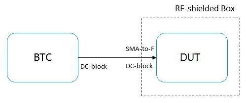
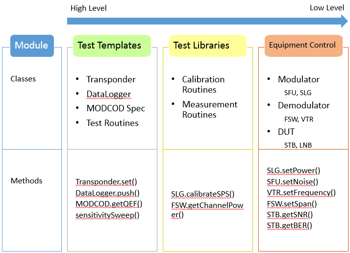

Summary
*******
The Space & Communications Test Automation (SCTA) libraries form a **general purpose** satellite test API. It can be used for any kind of Communications Lab/ ODU **testing**, **monitoring** and **evaluation**.

Our goal is to build **reusable**, **modular** code that makes any kind of testing or monitoring **easy to do** in code that satellite communications engineers can *understand*.

Simple test script
------------------
Imagine you want to measure the signal-to-noise ratio (SNR) of a satellite transponder generated by a Rhode & Schwarz RF modulator (BTC) across all operating frequencies of a coaxial cable (L-band). Perhaps your lab setup might look like this.

   Block diagram of a SNR measurement setup. The DUT is tuned to a noisy transponder generated by the BTC. The SNR is measured across L-band frequencies.

Here is an example of an automation script that is very easy to read, understand, and **modify** for your own custom tests.

.. code-block:: python
   :emphasize-lines: 2,12,18

   # Initialize equipment and output file
   mod = BTC()
   dut = VTR()
   csv = DataLogger("measurements.csv")

   # Test DUT on a DVB-S2 MODCOD 13 transponder, i.e. 8PSK 2/3
   txpdr = Transponder(mode=13)
   mod.setTransponder(txpdr)
   dut.setTransponder(txpdr)

   # Test performance across L-band frequencies, i.e. 250 - 2150 MHz
   Lband = list(range(250e6, 2150e6, 10e6))

   # Take SNR measurement at each frequency
   for freq in Lband:
       mod.setFrequency(freq)
       dut.setFrequency(freq)
       snr = dut.getSNR()
       csv.push(snr)

Software architecture
---------------------
This is a basic breakdown of the software modules. At the highest level, the user will interact with test templates that automate common calibration and measurement routines. The user can specify what to log and where to save it. At the lowest level are the equipment specific functions to control the most common test instruments.

