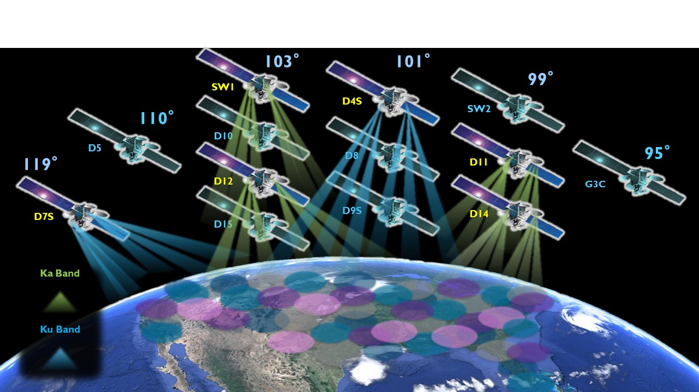

Transponders
************
What is a **Transponder**? Wikipedia_ says, "it is a *device* that gathers signals over a range of uplink frequencies and re-transmits them on a different set of downlink frequencies."

However, in the SCTA Libraries, a Transponder is certainly *not a device*, or even a class that represents a device. It is an **interface between the RF modulated signal and the lab equipment**. It is a class that stores only the signal characteristics necessary for the equipment to generate, frequency translate, tune, and measure the signal.

There are many important signal characteristics to define, so the `Transponder Class`_ is broken down into sublasses: the `Mode Class`_ and `Local Oscillator Class`_. There are also convenient ways to group together similar transponders using `Transponder Sets`_.

.. hint:: For a quick example of creating a Transponder, jump to the `Transponder Constructor`_ method.

.. _mode-class-label:

Mode Class
----------
The Mode class stores the parameters associated with a mode in the MODCOD Specification. The :ref:`modcod-spec-class-label` uses Modes to define the 32 DVB-S2 operational mode configurations and their corresponding SNR and PWR thresholds required to close the satellite link. The `Transponder Class`_ defines transponders using modes, including, but not limited to, the ones defined in the MODCOD Spec.

.. hint:: You can easily create a custom mode or a predefined mode from the MODCOD Spec. See the `Mode Constructor`_ method for an example.

Attributes
~~~~~~~~~~

- Broadcast Standard
- Modulation
- Code Rate

.. _`Mode Constructor`:

Methods
~~~~~~~

Contructor
  Description: A mode object can be initialized 2 different ways. One way is to individually specify broadcast standard, modulation, and code rate. The other way is to specify the MODCOD mode index as an integer in {1, 2, ..., 24}.

  Inputs: all attributes

  Outputs: instance of the Mode class

  .. code-block:: python

     # Option 1
     mode1 = Mode(bcstd="DTV", mod="QPSK", fec="1/2")

     # Option 2
     mode1 = Mode.fromMODCOD(1)

     # Both definitions are equivalent

Class definition
~~~~~~~~~~~~~~~~

.. code-block:: python

   class Mode(object):
       
       def __init__(self, bcstd='DTV', mod='QPSK', fec='1/2'):
           """Constructor.

           Default values create a MODCOD Mode 1

           ~~~~~ Possibilities ~~~~~
           bcstd: 	"DTV", "DVB-S", "DVB-S2"
           mod:	"QPSK", "8PSK"
           fec:	"1/2", "3/5", "2/3", "3/4", "4/5", 
           	"5/6", "6/7", "7/8", "8/9", "9/10"

           """
           self.bcstd = bcstd		# BroadCast STandarD
           self.mod = mod		# Modulation
           self.fec = fec		# FEC Rate

       @classmethod
       def fromMODCOD(cls, index):
           bcstd = MODCOD_spec[index]["bcstd"]
           mod = MODCOD_spec[index]["mod"]
           fec = MODCOD_spec[index]["fec"]
           return cls(bcstd, mod, fec)

Local Oscillator Class
----------------------
In a satellite broadcast system, a transponder goes through many frequency translations in its lifetime. The 3 main stages are upconversion at the broadcast center, translation at the satellite, and downconversion at the LNB. Each stage has its own local oscillator (LO) frequency. Furthermore, these LO frequencies are different depending on band: Ku, Ka, etc. The Local Oscillator Class stores this metadata for each transponder and provides convenient methods for calculating the transponder's uplink and downlink frequencies.

Attributes
~~~~~~~~~~
- Band
- Upconverter LO frequency
- Satellite LO frequency
- Downconverter LO frequency

Methods
~~~~~~~
getDownconversion(inputFreq)
  Description: Calculates the down-converted frequency based on the input frequency and LO frequency.

  Inputs: input frequency [MHz] (float)

  Outputs: down-converted frequency [MHz] (float)

getUpconversion(inputFreq)
  Description: Calculates the up-converted frequency based on the input frequency and LO frequency.

  Inputs: input frequency [MHz] (float)

  Outputs: up-converted frequency [MHz] (float)

Class Definition
~~~~~~~~~~~~~~~~

.. code-block:: python

   class LocalOsc(object):
       
       def __init__(self, id='LO', freq=0):
           """Constructor.

           ~~~~~ Possibilities ~~~~~
           id: 	string
           freq:	positive (float) [MHz]

           """
           self.id = id 	# identifier string
           self.freq = freq	# LO freq

.. _transponder-class-label:

Transponder Class
-----------------
The Transponder class is defined by a mode, a local oscillator, and all the downlink signal parameters associated with a transponder.

.. note:: All of the :ref:`equipment-classes-label` use transponders to generate lab signals and tune demodulators. 

.. hint:: There is a useful predefined list of all DVB-S2 transponders, which you can pick and choose from using `Transponder Sets`_.

Attributes
~~~~~~~~~~

- ID
- Mode
- Frequency
- Symbol Rate
- Roll-off
- Scrambling ID
- Pilot Symbols
- Antenna Polarization
- Local Oscillator

.. _`Transponder Constructor`:

Methods
~~~~~~~
Constructor
  Description: The transponder must be initialized with all of the above attributes. The mode can be either an integer Mode number or an instance of the `Mode Class`_.

  Inputs: all attributes

  Outputs: instance of the Transponder class

  .. code-block:: python

     # Create MODCOD Mode 1
     mode1 = Mode.fromMODCOD(1)

     # Input downlink parameters
     txpdr1 = Transponder(id="anything-you-want", mode=mode1, freq=974e6, symb=20e6, roll=20, scramb=0, pilot=True)

     # Equivalent transponder
     txpdr1 = Transponder(id="anything-you-want", mode=1, freq=974e6, symb=20e6, roll=20, scramb=0, pilot=True)

Class definition
~~~~~~~~~~~~~~~~

.. code-block:: python

   class Transponder(object):
       
       def __init__(self, id='txp', mode=1, freq=1074e6, symb=20e6, roll=20, scramb=0, pilot=True, pol=None, LO=None):
           """Constructor.

           Default values Create a MODCOD Mode 1 Transponder @ 1074 MHz

           ~~~~~ Possibilities ~~~~~
           mode:	integer Mode number or Mode class instance
           freq: 	float in Hz
           symb: 	float in Baud
           roll:	[0, 100] %
           scramb:	[0, 2^18-1]
           pilot:	False, True (off, on)
           pol:	"LHCP", "RHCP", "horizontal", "vertical"

           """
           self.id = id	# human-readable identifier
           self.mode = mode	# Mode class instance 
           self.freq = freq	# Center frequency
           self.symb = symb	# Symbol rate
           self.roll = roll	# roll-off
           self.scramb = scramb	# Scrambling code
           self.pilot = pilot	# Pilot symbols
           self.pol = pol	# Antenna polarization
           self.LO = LO	# Local Oscillator class instance

Transponder Sets
----------------
Sometimes you might want to group together several transponders that are related. Some predefined groups of transponders are subdivided by:

1. Orbital Slot
2. Satellite
3. Bands
4. Market (CONUS/ spot)
5. HD/ SD

   Cartoon of satellite spot beams in Ku and Ka Bands. We can easily group transponders based on orbital slot, bands, market, etc.

For example, suppose we are given a group of all transponders from one satellite and a group of all spot-beam transponders across all satellites. Suppose we want *only* the spot-beam transponders from that one satellite. What we want is the *intersection* of these two groups. To accomplish this, we use python ``sets``.

set
  In Python, a set is an unordered collection with no duplicate elements. 

.. hint:: For example, say we have a list of transponders, and some of them are identical in mode and downlink parameters. If we create a ``set`` from this list, all the duplicate transponders would be filtered out, and the list's original order is not guaranteed.

set operations
  Python supports set operations like union, intersection, difference, and exclusive or.

For example, we might want to test only the LHCP transponders from satellites in Orbital Slot 101W. We could make a custom set of all LHCP transponders and intersect that with the predefined set of 101W transponders. The possibilities are endless.

Here is the corresponding pseudocode:

.. code-block:: python

   # Create 3 hypothetical transponders
   txpdr1 = Transponder(id='101W-txpdr1', mode=1, freq=250e6, pol="RHCP")
   txpdr2 = Transponder(id='101W-txpdr2', mode=1, freq=950e6, pol="LHCP")
   txpdr3 = Transponder(id='99W-txpdr5', mode=1, freq=2150e6, pol="LHCP")

   # Group the transponders into hypothetical sets
   slot101 = set([txpdr1, txpdr2])
   lhcp = set([txpdr2, txpdr3])

   # I want all slot 101 W, LHCP transponders
   intersect = slot101 & lhcp

.. _Wikipedia: https://en.wikipedia.org/wiki/Transponder