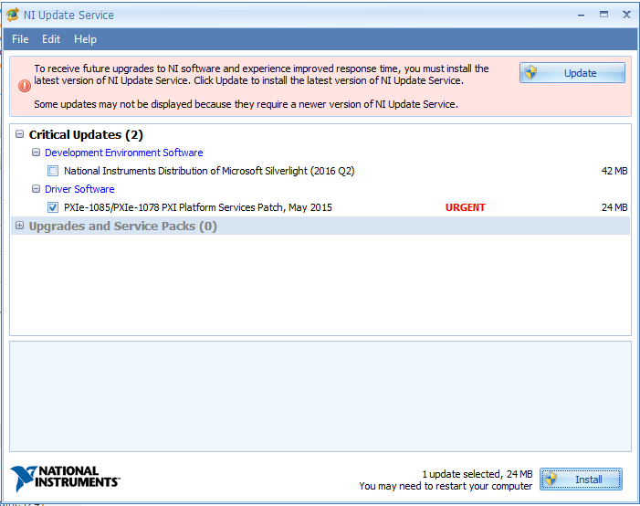
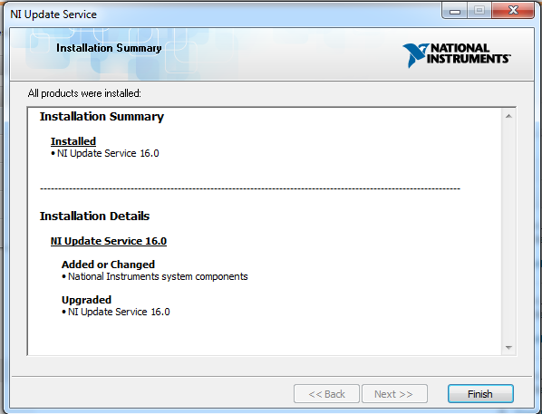
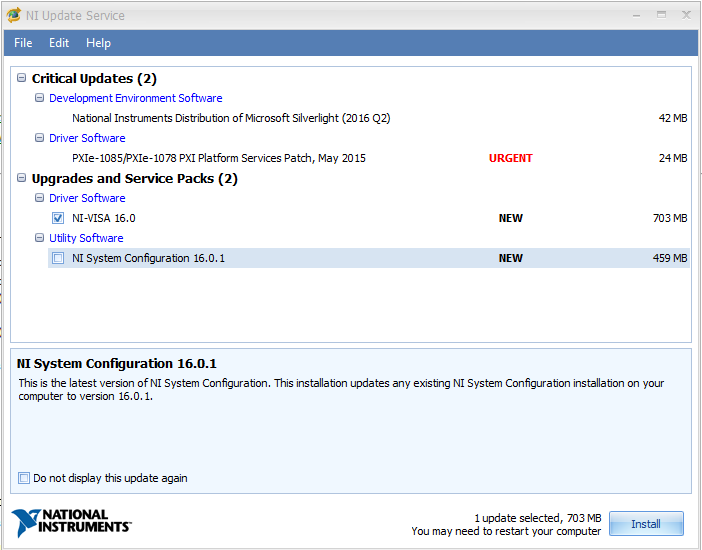
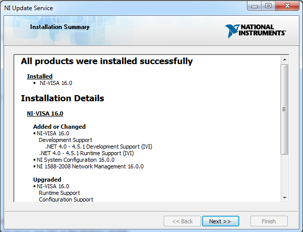
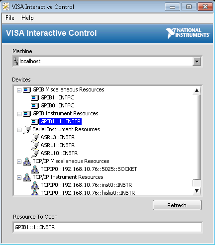

.. _visa-installation-label:

VISA Drivers
************

The SCTA libraries use the Virtual Instrument Software Architecture (VISA_) standard I/O commands to control our lab equipment. The VISA standard is widely accepted by the Test & Measurement Industry, such as National Instruments, Rhode & Schwarz, and Keysight Technologies. We will be installing VISA equipment drivers provided by National Instruments.

Installing NI-VISA
------------------

.. hint:: Search your programs for ``NI-VISA``. If you already have NI-VISA installed, skip this section.

If you do not have NI-VISA installed, go to the downloads_ page at the National Instruments website.

You may have to login with an existing National Instruments account. Download the latest NI-VISA Run-Time Engine.

.. note:: The SCTA libraries have been tested with NI-VISA version 16.0

Updating NI-VISA
----------------

In programs, open the NI Update Service.

If you see a red banner telling you to update the NI Update Service, click the Update button.

Click Yes when asking to allow changes to the computer. When prompted, accept all license agreements. When the update is complete, you will be prompted to restart the computer.

After restarting, open NI Update Service again. The red banner should be gone. The ``Critical Updates`` section should already be expanded, but also expand the ``Upgrades and Service Packs`` section. Check anything related to ``NI-VISA`` under the ``Driver Software`` sections. 

When prompted, accept all license agreements. When the drivers are installed, you will be prompted to restart the computer.

Installing GPIB drivers
-----------------------

.. warning:: Please ask Luis to fill out this section!

VISA Interactive Control
------------------------

In programs, open the VISA Interactive Control.

Any equipment connected to the network should be listed under the ``Devices`` section.

.. _VISA: https://en.wikipedia.org/wiki/Virtual_Instrument_Software_Architecture
.. _downloads: http://search.ni.com/nisearch/app/main/p/bot/no/ap/tech/lang/en/pg/1/sn/catnav:du,n8:3.1637,ssnav:sup/