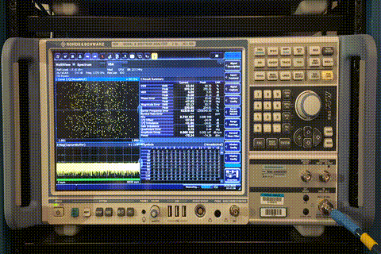
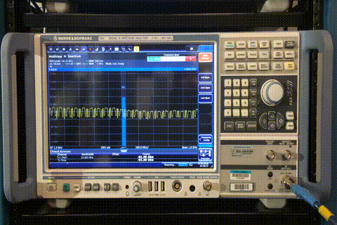

.. SCTA documentation master file, created by
   sphinx-quickstart on Fri Aug 19 13:04:27 2016.
   You can adapt this file completely to your liking, but it should at least
   contain the root `toctree` directive.

Welcome to SCTA's documentation!
********************************

.. warning:: This documentation is under construction. Please check regularly for updates.

Imagine all the manual configuration it takes to accurately measure something as simple as channel power on a spectrum analyzer like the Rhode & Schwarz FSW:

Now you don't have to! In the time it takes to make one manual measurement, this automation script can make 20:

With these automation libraries you can spend less time making repetitive signal measurements and more time analyzing the data. You can even automate trivial monitoring tasks anytime, anywhere.

Contents
  .. toctree::
     :maxdepth: 2

     Installation
     Tutorial
     UserGuide
     DeveloperGuide
     Motivational

Indices and tables
******************

* :ref:`genindex`
* :ref:`modindex`
* :ref:`search`

.. _lists: https://docs.python.org/2.7/tutorial/datastructures.html#more-on-lists

.. _dictionaries: https://docs.python.org/2.7/tutorial/datastructures.html#dictionaries

.. _classes: https://docs.python.org/2.7/tutorial/classes.html