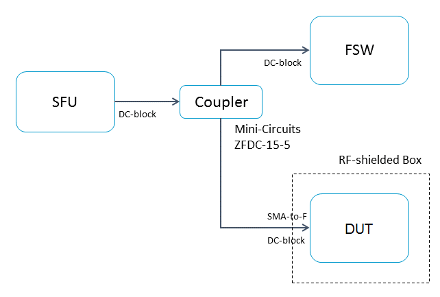

Test Templates
**************

Frequency Sweep Test Template
-----------------------------

Imagine you want to measure the Power or SNR measurement accuracy of a satellite receiver compared to a vetted RF test instrument like the Rhode & Schwarz FSW. Perhaps your lab setup might look like this.

   Block diagram of a power accuracy test setup. Both the FSW and DUT are tuned to a transponder generated by the SFU. Since the input signal is split into different paths, the individual path losses to the FSW and the DUT should be properly accounted for in the data analysis.

This automation script will perform a frequency sweep and measure MER/CNR and power at both the FSW and the DUT. An analysis of the measurement data can be found in ``SCTA_repo\src\examples\RF-Validation-Presentation.ipynb``.
	
.. code-block:: python

   from SCTA.Instrumentation import SFU, VTR, FSW
   from SCTA.System import Transponder
   from SCTA.DataLogging import DataLogger

   # Initialize equipment
   sfu = SFU(type="IP", port="192.10.10.7")
   fsw = FSW(type="IP", port="192.10.10.8")
   dut = VTR(type="IP", port="192.10.10.9")

   # Format output file
   header=['Frequency (Hz)', 'VTR SNR (dB)', VTR Power (dBm)', 'FSW SNR (dB)', FSW Power (dBm)']
   csv = Log(filename="FrequencySweep", format="csv", csv_header=header)

   # Test DUT on a DVB-S2 MODCOD 13 transponder, i.e. 8PSK 2/3
   txp = Transponder(id="101-txp1", mode=13, freq=974e6, symb=20e6, roll=20, scramb=0, pilots=False)
   sfu.setTransponder(txp)
   fsw.setTransponder(txp)
   dut.setTransponder(txp)
 
   # Test performance across L-band frequencies, i.e. 250 - 2150 MHz
	for freq in range(250e6, 2150e6, 10e6):
    	sfu.setFrequency(freq)
   	dut.setFrequency(freq)
   	fsw.setFrequency(freq)

      # Take measurements and write them to the output file
      fsw_meas = fsw.getAllMeasurements()
      vtr_meas = vtr.getAllMeasurements()
      sample = [freq, vtr_meas['mer'], vtr_meas['power'], fsw_meas['mer'], fsw_meas['power']]
      csv.push(sample)

BER Test Template
-----------------

Imagine you want to test the frequency sensitivity of a satellite receiver to low power conditions near the specified QEF point. Perhaps your lab setup might look like this.

.. figure:: _static/img/sensitivity-setup.png
   :alt: RF front-end test block diagram
   :scale: 80 %

   Block diagram of a frequency sensitivity test setup. The DUT is tuned to a low-power transponder generated by the BTC. The DUT does not lock to the signal at first, so the BTC power is increased until the DUT locks and measures no bit errors. This QEF point is measured across frequency.

This automation will perform a frequency sweep and find the QEF point for the DUT. An analysis of the measurement data can be found in ``SCTA_repo\src\examples\RF-Validation-Presentation.ipynb``.

.. code-block:: python

   from SCTA.Instrumentation import BTC, VTR
   from SCTA.System import Transponder
   from SCTA.DataLogging import DataLogger
   from time import sleep

   # Initialize equipment
   btc = BTC(type="IP", port="192.10.10.7")
   dut = VTR(type="IP", port="192.10.10.9")

   # Format output file
   header = ['Frequency (Hz)', 'BTC Power (dBm)', 'Bert Lock', 'Bit Error Rate']
   csv = Log(filename="FrequencySweep", format="csv", csv_header=header)

   # Test DUT on a DVB-S2 MODCOD 13 transponder, i.e. 8PSK 2/3
   txp = Transponder(id="101-txp1", mode=13, freq=974e6, symb=20e6, roll=20, scramb=0, pilots=False)
   btc.setTransponder(txp)
   dut.setTransponder(txp)
 
   # Test performance across L-band frequencies, i.e. 250 - 2150 MHz
   for freq in range(250e6, 2150e6, 10e6):
      btc.setFrequency(freq)
      dut.setFrequency(freq)

      # Reset power level on the BTC
      power = -85
      btc.setPower(power)
   
      # Run BERT for 5 seconds and check if the BERT is locked AND has no errors
      dut.restartBERT()
      sleep(5)
      dut_meas = dut.getMeasurements()

      # If not, then increase BTC input power by 0.1 dB
      while (dut_meas['Bert Total Bit Error'] != 0) or (dut_meas['Bert Lock'] != True):
         power = power + 0.1
         btc.setPower(power)
         dut.restartBERT()
         sleep(5)
         dut_meas = dut.getMeasurements()

      # Else, stop the test and log the BERT statistics
      sample = [freq, power, aim_meas['Bert Lock'], aim_meas['Bit Error Rate']]
      csv.push(sample)
